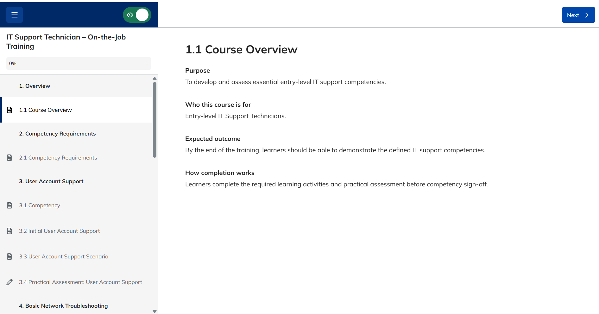
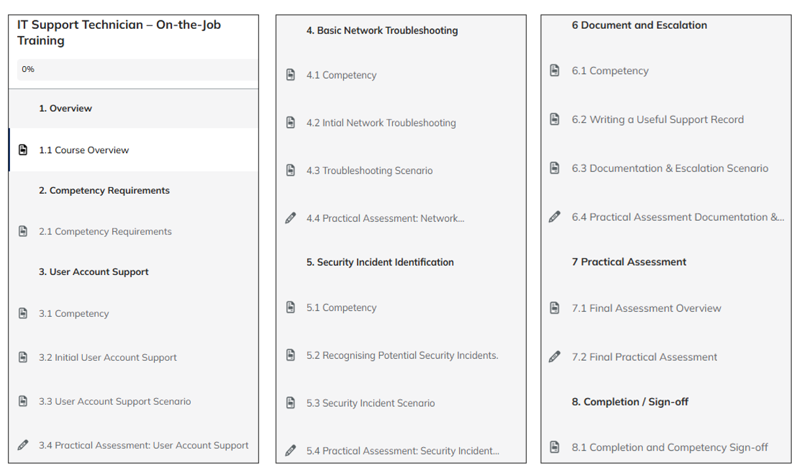
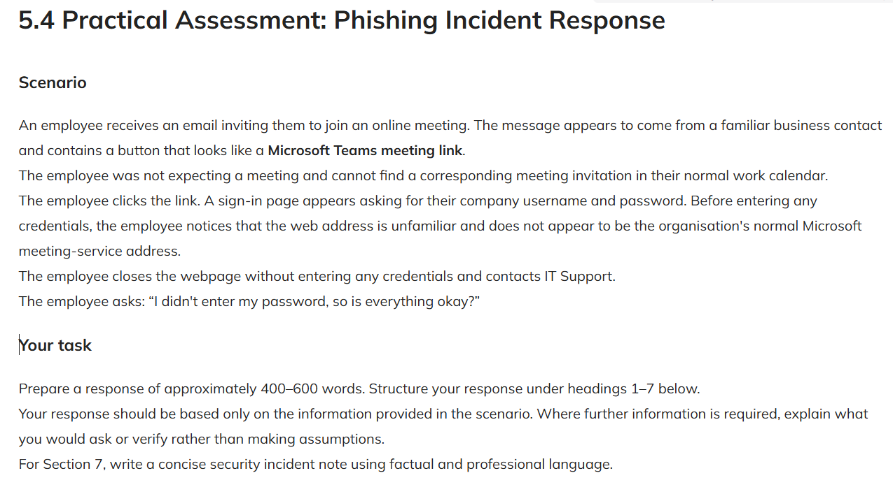
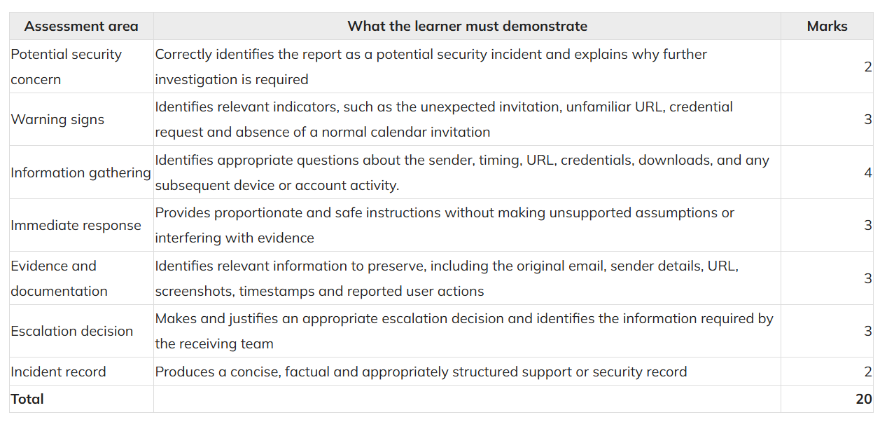
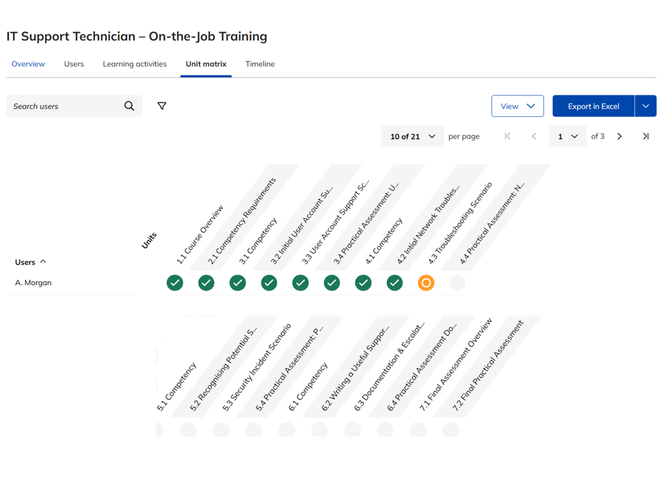

# TalentLMS Project Screenshots

This folder contains selected screenshots from a competency-based IT support learning programme that I designed and developed in TalentLMS.

The screenshots demonstrate the course structure, learning activities, assessment approach and LMS administration features used in the project.

## Screenshot Guide

All learner names and identifying details displayed in these screenshots are fictional and used solely for demonstration purposes.

### 01-course-overview.png

Displays the course title, description and intended learning purpose.

### 02-module-structure.png

Shows the course modules and learning units arranged in a structured sequence.

### 03-learning-scenario.png

Presents learners with a suspected phishing incident involving a fraudulent Microsoft Teams meeting link. Learners must identify warning signs, gather relevant information, advise the affected user, preserve potential evidence and determine whether escalation is required.

### 04-assessment-rubric.png

Shows the assessment rubric used to evaluate incident identification, information gathering, immediate response, evidence handling, escalation and documentation.

### 05-progress-report.png

Shows the TalentLMS Unit Matrix used to monitor an individual learner’s completed, current and remaining course units.

